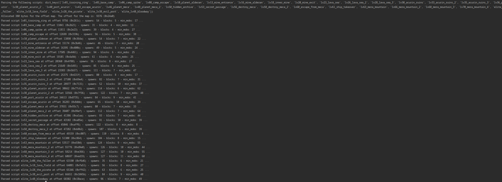

### Bots Dungeon Tools

Modify the paths to your need. You can only test the dungeon binary file while the client is open. The other files are registered once the client initially starts.

Generating dungeon.bin:\
`python main.py generate_dungeon_bin "c:/Program Files (x86)/Icseon/T-Bot Rewritten/script/dungeon/dungeon.bin"`

Generating map_planet.bin:\
`python main.py generate_map_bin files/map_planet.json "c:/Program Files (x86)/Icseon/T-Bot Rewritten/script/map_planet.bin"`

Generating map_daeth.bin:\
`python main.py generate_map_bin files/map_daeth.json "c:/Program Files (x86)/Icseon/T-Bot Rewritten/script/map_daeth.bin"`

Generating map_base.bin:\
`python main.py generate_map_bin files/map_base.json "c:/Program Files (x86)/Icseon/T-Bot Rewritten/script/map_base.bin"`

There is a work in progress GUI that you could use, but it is incomplete. To start that, run:
`python gui.py`
### Extractor Advance
ohka bots
Unpacking  dungeon.bin:\

